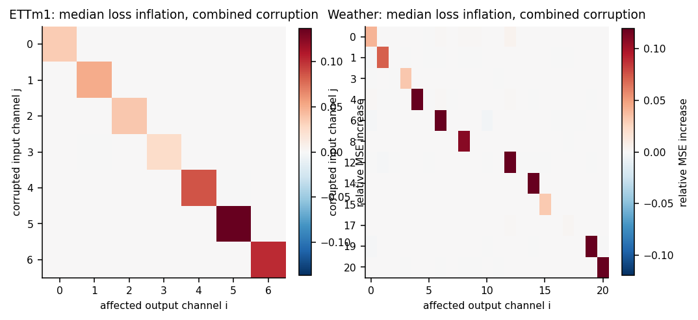
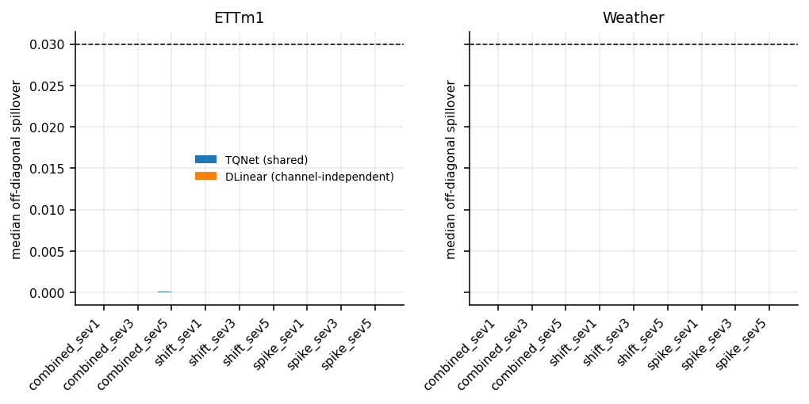
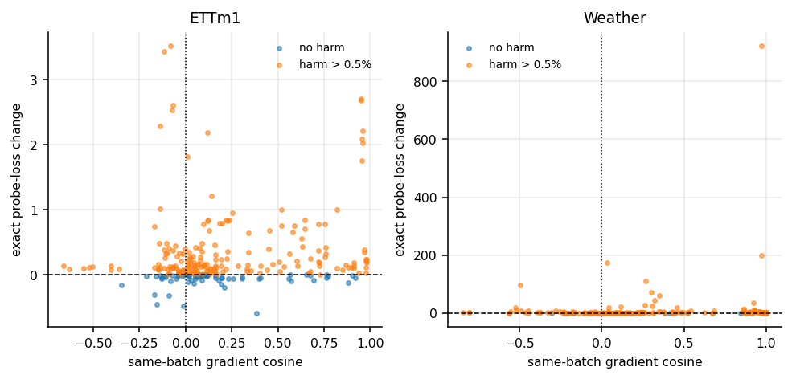
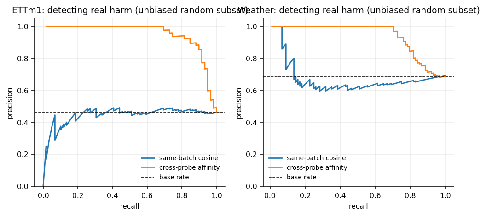
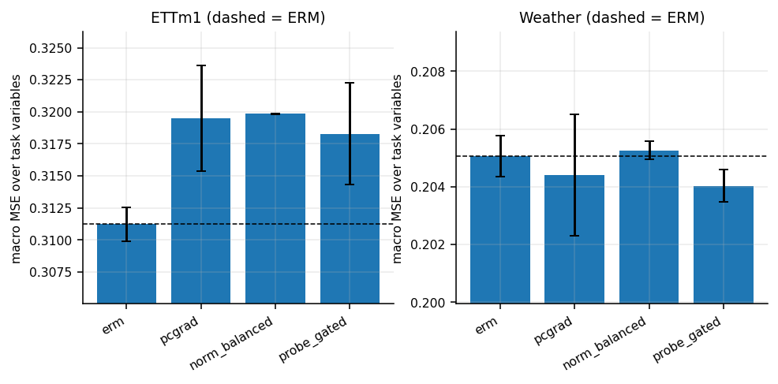
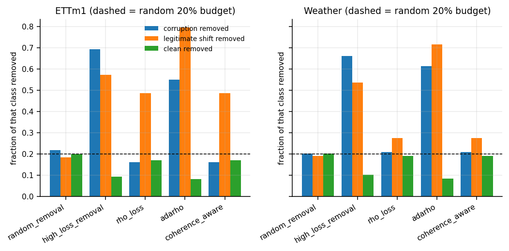
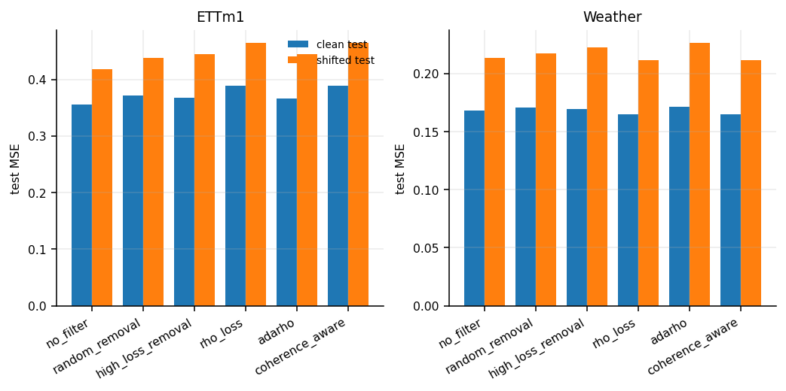
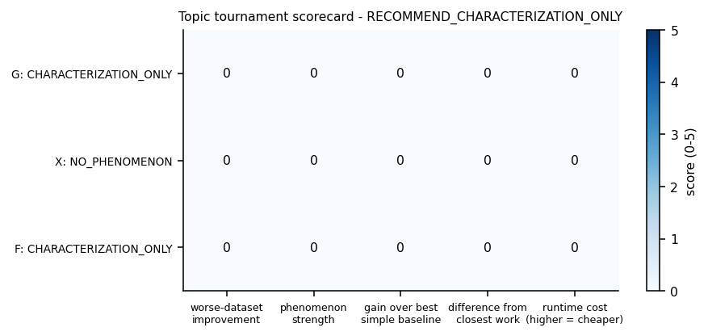

# TS-IDEA-TOURNAMENT-v1 — three independent time-series screening tracks

## 1. 제안

세 개의 서로 독립적인 시계열 실패 가설을 같은 데이터·같은 clean baseline 위에서
빠르게 검사하고, 실제 후속 연구 가치가 가장 높은 하나를 고른다. 하나를 깊게 파는 것이
목적이 아니다.

- 트랙 G — Harmful Gradient Interference: gradient cosine이 음수인 것 자체가 정말
  다른 변수의 미래 성능을 해치는 update를 뜻하는가?
- 트랙 X — Cross-Channel Corruption Spillover: 입력 채널 하나만 잘못 측정되면
  정상 채널의 예측까지 나빠지는가?
- 트랙 F — Corruption vs Legitimate-Shift Data Selection: 기존 selection 알고리즘이
  "배우면 안 되는 관측 오류"와 "배워야 하는 regime 변화"를 구별하는가?
- 트랙 V — Validation Stability Audit (보조): 한 validation 구간에서 좋았던 모델이
  다음 시기에도 좋은가? 다른 트랙의 판정을 바꾸지 않는다.

판정 지표는 트랙마다 사전등록으로 동결했다
(`results/ts_idea_tournament_v1/preregistration.json`). 각 트랙은 순서대로
(1) 현상 존재 → (2) 단순 baseline이 이미 해결하는가 → (3) 잔여 문제 → (4) 최소 개입의
효과 → (5) 두 데이터셋 방향 일치를 확인하고, 다음 중 하나로 분류한다:
`METHOD_GO` / `CHARACTERIZATION_ONLY` / `SIMPLE_BASELINE_SOLVES` / `NO_PHENOMENON` /
`NOT_EVALUATED`.

예상 실패 모드: 세 현상이 모두 실재하지만 단순 baseline이 이미 처리하거나, 개입 이득이
두 데이터셋에서 방향이 갈리는 것. 중단 기준: 한 트랙이 애매해도 예산을 넘겨 고치지
않고 판정을 내린 뒤 다음 트랙으로 간다.

### 공통 설정

| 항목 | 값 |
| --- | --- |
| 데이터 | ETTm1, Weather (공식 LTSF source, sha256 일치 확인) |
| 예측 계약 | lookback 96 → horizon 96, multivariate-to-multivariate |
| split | 공식 TQNet data provider 계약 그대로 (ETTm1 12/4/4개월, Weather 0.7/0.1/0.2) |
| 정규화 | train-only StandardScaler |
| 공유 모델 A | TQNet (공식 config, ICML 2025) |
| 채널독립 모델 B | DLinear individual heads |
| clean seed | 2026090601, 2026090602 |
| 런타임 tier | FULL (projected 2.54 GPU-hours) |

### clean baseline sanity

| dataset | TQNet test MSE | DLinear test MSE | 비율 | 판정 |
| --- | --- | --- | --- | --- |
| ETTm1 | 0.3112 | 0.3324 | 0.936 | OK, weak 아님 |
| Weather | 0.1574 | 0.1607 | 0.979 | OK, weak 아님 |

두 값 모두 논문 보고치 근방(TQNet ETTm1 ~0.317, Weather ~0.157)이며 NaN·발산·상수예측·
형상오류·누수 플래그가 없다.

## 2. 결과

최종 추천: `RECOMMEND_CHARACTERIZATION_ONLY`

| Track | 현상 | 단순 baseline이 해결 | 새 개입 | 데이터셋 일치 | 판정 |
| --- | --- | --- | --- | --- | --- |
| X | `X_NO_SPILLOVER` | 해당 없음 | 없음 | 같은 방향 | `NO_PHENOMENON` |
| G | `G_PHENOMENON_GO` | 아니오 | 이득 없음 | 방향 충돌 | `CHARACTERIZATION_ONLY` |
| F | `F_SELECTION_CONFOUNDING_PRESENT` | 아니오 | 발동 안 함 | 방향 충돌 | `CHARACTERIZATION_ONLY` |
| V | — | — | — | — | `V_NO_STRONG_SELECTION_INSTABILITY` |

METHOD_GO 는 하나도 없다. 현상이 강한 트랙은 G 와 F 두 개다.

---

### X — Cross-Channel Corruption Spillover

[관찰] 공식 TSRBench corruption 을 입력 채널 하나에만 넣었을 때, 그 채널 자신의
예측은 크게 망가지지만(ETTm1 combined severity 5 에서 직접 손상 중앙값 +277%,
Weather +147%) 다른 정상 채널의 예측은 거의 그대로다. 18개 (데이터셋 × 오염종류 ×
강도) 칸 전부에서 off-diagonal 중앙값이 0.0000, 평균은 최대 +0.85%.

조작 점검을 먼저 했다. 오염은 실제로 도달한다 — 평가 window 의 17~90% 가 오염된
값을 포함하고(combined severity 5 에서 ETTm1 90.4%, Weather 87.8%), 20개
deterministic 예제에서 splice 는 공식 변환과 완전히 일치하며 다른 채널 편차는 0.0.
즉 이것은 구현 실패가 아니라 실제 null 이다.

다만 꼬리는 있다. combined severity 5 에서 정상 채널의 29.5%(ETTm1) / 15.7%(Weather)
가 1% 넘게 나빠지고, 최악의 정상 채널은 +72%(ETTm1) / +134%(Weather) 까지 간다.
전형적인 채널은 멀쩡한데 드물게 크게 다치는 형태다.

[판정] `X_NO_SPILLOVER` → 트랙 판정 `NO_PHENOMENON`. 사전등록 게이트(두 데이터셋
모두에서 최소 2개 오염 계열이 off-diagonal 중앙값 3% 이상)를 어느 칸도 통과하지 못했다.
이후 clipping / channel dropout / detected quarantine 은
`DIAGNOSTIC_CONTINUATION_AFTER_X_PHENOMENON_FAIL` 역할로만 실행했고, 줄일 spillover
자체가 없어 감소율이 정의되지 않는다. quarantine 은 ETTm1 clean MSE 를 47% 악화시켰다
(clean validation 에서 5% 오탐률로 보정한 검출기가 정상 window 도 median 으로
대체하기 때문).

[해석] 구조적 이유가 있다. TQNet 은 채널별 instance normalization(RevIN)을 쓰므로
한 채널에 상수 오프셋을 더하면 다른 채널 출력이 비트 단위로 동일하다
(테스트 `T06c` 로 고정). 형태를 바꾸는 오염만 cross-channel attention 에 도달하고,
그것도 대부분 자기 채널에서 소진된다. "shared multivariate model 은 오염을 퍼뜨린다"
는 직관은 최소한 RevIN 을 쓰는 최신 LTSF 모델에서는 기본적으로 성립하지 않는다.
후속 연구 대상으로는 약하다.

---

### G — Harmful Gradient Interference

[관찰] 현상은 두 데이터셋 모두에서 강하게 확인됐다.

| | ETTm1 | Weather |
| --- | --- | --- |
| exact harm 비율 (선택 표본) | 0.730 | 0.836 |
| exact harm 비율 (편향 없는 random subset) | 0.461 | 0.688 |
| block bootstrap 95% CI | [0.660, 0.793] | [0.781, 0.879] |
| same-batch cosine 검출기 FP | 0.266 | 0.230 |
| same-batch cosine 검출기 FN | 0.715 | 0.737 |
| AUPRC same-batch cosine | 0.733 | 0.813 |
| AUPRC cross-probe affinity | 0.994 | 0.981 |

핵심은 harm 비율이 아니라 마지막 네 줄이다. "gradient cosine 이 음수"라는 기존
신호는 실제 harm 을 거의 못 맞힌다 — 놓치는 비율(FN)이 72~74% 이고 AUPRC 는 기저율
수준이다. 반면 train-only probe batch 에서 잰 cross-probe affinity 는 거의 완벽하게
맞힌다.

편향 점검을 했다. exact 검증 표본의 절반이 affinity 상위로 뽑혔으므로 AUPRC 가
기계적으로 부풀려진다. 편향 없는 random subset 만으로 다시 계산해도 결론은 유지된다:
cross-probe affinity 0.86~1.00 vs same-batch cosine 0.44~0.73(기저율 근처).

[판정] `G_PHENOMENON_GO` 이지만 개입 이득이 없어 트랙 판정 `CHARACTERIZATION_ONLY`.

| macro MSE | ERM | PCGrad | norm-balanced | probe-gated |
| --- | --- | --- | --- | --- |
| ETTm1 | 0.31124 | 0.31949 | 0.31984 | 0.31828 |
| Weather | 0.20505 | 0.20439 | 0.20526 | 0.20402 |

probe-gated 는 ETTm1 에서 ERM 대비 2.26% 나쁘고 Weather 에서 0.50% 좋다. 사전등록
기준(ERM 대비 0.7% 이상, PCGrad 대비 0.3% 이상, 두 데이터셋 모두 양수, 어느 쪽도
-0.5% 미만 악화 없음, bootstrap 하한 > 0) 중 5개가 실패했다. PCGrad 와
norm-balanced 도 ERM 을 이기지 못하므로 기존 baseline 이 해결한 것도 아니다.
probe-gated 는 ETTm1 에서 추가 probe forward 942회, Weather 에서 13,326회를 쓰고
wall time 이 ERM 의 1.3~3.3배인데 이 비용은 정확도 비교와 섞지 않고 따로 보고한다.

[해석] 진단 신호와 개입 사이의 간극이 이 트랙의 진짜 결과다. "어떤 update 가 다른
변수를 해치는가"는 매우 잘 예측할 수 있는데(AUPRC 0.98~0.99), 그 예측을 PCGrad 식
projection gate 로 바꾸면 이득이 사라진다. 두 가지 해석이 가능하다: (a) harm 예측이
맞아도 projection 이 올바른 교정이 아니거나, (b) 한 task 의 gradient 방향으로 full
ERM step 크기만큼 움직이는 harm 정의가 실제 optimizer 궤적과 너무 멀거나. 후속
연구가 있다면 "더 나은 gate"가 아니라 harm 정의 자체를 실제 update 와 정렬시키는
쪽이다.

---

### F — Corruption vs Legitimate-Shift Data Selection

[관찰] 현상은 두 데이터셋 모두에서 강하게, 그리고 예상보다 크게 확인됐다.
제거 예산은 모든 방법이 정확히 동일하다(ETTm1 513개, Weather 548개).

| ETTm1 | 오염 제거율 | regime shift 제거율 | clean 제거율 | shifted test 악화 (vs no-filter) |
| --- | --- | --- | --- | --- |
| random (예산 20%) | 0.218 | 0.183 | 0.200 | — |
| high-loss removal | 0.693 | 0.572 | 0.092 | +6.2% |
| RHO-LOSS | 0.160 | 0.486 | 0.169 | +10.9% |
| AdaRho | 0.549 | 0.794 | 0.082 | +6.5% |

| Weather | 오염 제거율 | regime shift 제거율 | clean 제거율 | shifted test 악화 |
| --- | --- | --- | --- | --- |
| random (예산 20%) | 0.201 | 0.190 | 0.201 | — |
| high-loss removal | 0.661 | 0.536 | 0.100 | +4.3% |
| RHO-LOSS | 0.208 | 0.274 | 0.190 | -1.1% |
| AdaRho | 0.613 | 0.715 | 0.084 | +5.9% |

AdaRho 가 가장 극단적이다. 오염을 55~61% 걸러내는 대신 정상적인 regime 변화의
72~79% 를 같이 버린다 — random 예산(19~20%)의 3.6~4.2배다. high-loss removal 도
54~57% 를 버린다. 그 결과 shifted test 성능이 no-filter 보다 4.3~6.5% 나빠진다.
즉 "training loss 가 크다"는 신호는 오염과 regime 변화를 사실상 구별하지 못한다.

RHO-LOSS 는 반대 방향으로 특이하다. 오염을 random 보다도 덜 걸러내면서(ETTm1 0.160
vs random 0.218) regime shift 는 더 많이 버린다(0.486). ETTm1 에서는 shifted test 를
가장 크게 악화시켰다(+10.9%).

[판정] `F_SELECTION_CONFOUNDING_PRESENT` 이지만 새 개입이 발동하지 않아 트랙 판정
`CHARACTERIZATION_ONLY` (`F_SELECTION_CHARACTERIZATION`).

coherence-aware preserve 는 두 데이터셋 모두에서 RHO-LOSS 와 완전히 동일한
window 를 제거했다. 이유는 사전등록된 두 조각이 서로 맞지 않기 때문이다. severity
보정(F5)은 오염과 regime shift 의 training loss 중앙값 차이를 최소화하는 쌍을 고르는데,
그 결과 `sev_shift = 1.0` 이 선택됐다(ETTm1 0.7439 vs 오염 0.8005, Weather 0.6031 vs
0.5452). 그런데 coherence 판정(F15)은 A 항과 B 항이 각각 1 train IQR 이상일 것을
요구한다. sev 1.0 에서 그 조건을 만족하는 window 는 사실상 없다(측정: sev 4.0 에서만
ETTm1 73% / Weather 26% 발동, sev 2.0 에서 3% / 0%). 검출기는 코드상 정상이며
(단위 테스트 2개로 확인: coherent 후보가 있으면 rho 와 다르게, 없으면 동일하게,
예산은 항상 동일), 단지 보정된 강도에서 발동할 수 없다.

결과를 본 뒤 severity 나 임계값을 바꾸는 것은 금지되어 있으므로 v1 에서는 바꾸지
않았다. gates 가 보고한 "shifted test +5.1%(Weather)" 는 coherence 개입의 이득이
아니라 RHO-LOSS 와 high-loss removal 의 차이일 뿐이므로 METHOD_GO 근거로 쓰지 않는다.

[해석] 세 트랙 중 후속 연구 가치가 가장 높은 현상이다. 문제가 크고(정상 regime
변화의 최대 79% 손실), 하류 성능에 실제로 나타나며(shifted test 4~11% 악화),
기존 방법 세 개가 모두 같은 방향으로 실패한다. 다만 v1 이 제안한 median 기반
coherence 규칙은 loss-matching 이 만드는 미묘한 강도 영역에서 발동하지 않으므로,
후속 연구는 임계값을 낮추는 게 아니라 강도에 스케일 불변인 coherence 통계
(예: 입력 꼬리와 목표의 회귀 기울기 일치도)로 다시 설계해야 한다.

---

### V — Validation Stability Audit (보조)

[관찰] 후보 모델 7개(clean TQNet/DLinear, TQNet ERM/PCGrad/norm-balanced/probe-gated,
TQNet channel-dropout)에 대해 validation 8개 origin, test 8개 origin.
validation 순위와 test 순위의 Kendall tau 는 ETTm1 +0.35, Weather -0.075 이고
인접 validation origin 사이의 순위 뒤집힘 비율은 0.94 / 0.57 이다.

| selection rule | ETTm1 test regret | Weather test regret |
| --- | --- | --- |
| latest 1 origin | 0.0000 | 0.0253 |
| last 2 | 0.0212 | 0.0253 |
| last 4 | 0.0212 | 0.0253 |
| full 8 | 0.2724 | 0.0253 |
| ARW (공식 `eliselyhan/ARW`) | 0.0000 | 0.0253 |

[판정] `V_NO_STRONG_SELECTION_INSTABILITY`. 사전등록 조건(두 데이터셋 모두에서
latest-origin regret 2% 이상이고 last4 또는 ARW 가 이를 30% 이상 줄임)이 성립하지
않는다 — ETTm1 에서는 latest-1 이 오히려 최선이고, Weather 에서는 모든 규칙이 같은
모델을 골라 regret 이 동일하다. ARW 는 공식 구현을 그대로 import 해 썼고 선택된
window 는 두 데이터셋 모두 1이었다.

[해석] 순위 자체는 매우 불안정한데(뒤집힘 비율 0.57~0.94, Weather 는 tau 가 음수)
regret 이 작은 이유는 후보 모델들의 test 성능이 서로 가깝기 때문이다. 즉 "고르기
어렵지만 잘못 골라도 손해가 작은" 상황이다. Track V 는 설계대로 G/X/F 판정을
바꾸지 않았다.

---

## 3. 한계

- X 의 중앙값 지표는 희석된다. 오염은 Poisson 빈도로 주입되므로 낮은 강도에서는
  평가 window 의 다수가 손상되지 않는다. 다만 combined severity 5 에서는 90% 의
  window 가 손상되고도 off-diagonal 중앙값이 0 이므로, 이 희석이 null 을 만든 원인은
  아니다. 그래도 후속 연구는 "손상된 window 로 조건부"인 지표를 사전등록해야 한다.
- G 의 harm 정의가 실제 optimizer step 과 다르다. 한 task 의 정규화된 gradient
  방향으로 full ERM gradient norm 만큼 이동하는 것은 실제 학습이 하는 일이 아니다.
  harm 비율이 46~69% 로 높게 나온 데에는 이 정의가 크게 기여한다. 이것은 사전등록된
  절차라 v1 에서 바꾸지 않았고(설계 약점 분류 C) 한계로 기록한다.
- G 의 AUPRC 표본이 편향돼 있다. exact 검증 대상의 절반을 affinity 상위에서
  뽑으므로 절대 AUPRC 는 과대평가다. 편향 없는 random subset 재계산을 함께 보고했고
  결론은 유지된다.
- F 의 severity 보정과 coherence 임계가 서로 맞지 않는다. 위에 쓴 대로 새 개입이
  구조적으로 발동할 수 없었다. v1 의 F method 판정은 사실상 "미검정"에 가깝다.
- F 의 window 는 stride 12 로 겹친다. 각 window 는 정확히 하나의 class 를 갖고
  독립 sample 로 materialise 되지만, 시간적으로 인접한 window 들은 원본 구간을
  공유한다.
- 채널 부분집합. Weather 는 계산량 때문에 21채널 중 12채널만 오염·task 대상으로
  썼다(train variance 순위 등간격, test 미참조).
- seed 2개. FULL tier 에서 clean·개입 모두 seed 2개다. 0.5% 수준의 차이를 가르기에는
  얇다.
